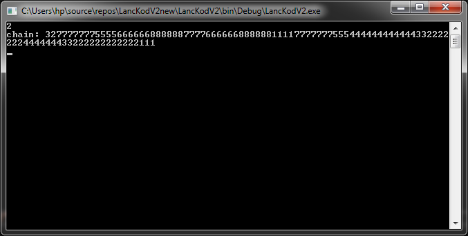
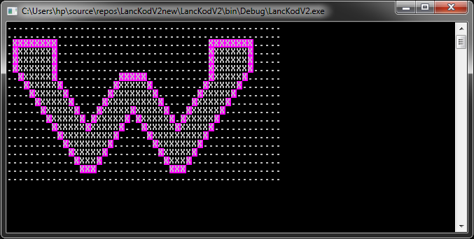

# FF-Chaincode
OE NIK Half year project work

The base documentatio:
[here](./docs/docFromTeacher.pdf)

  
here you can see the result code for the input.

  
the result graphical representation.

  
a complex spot
